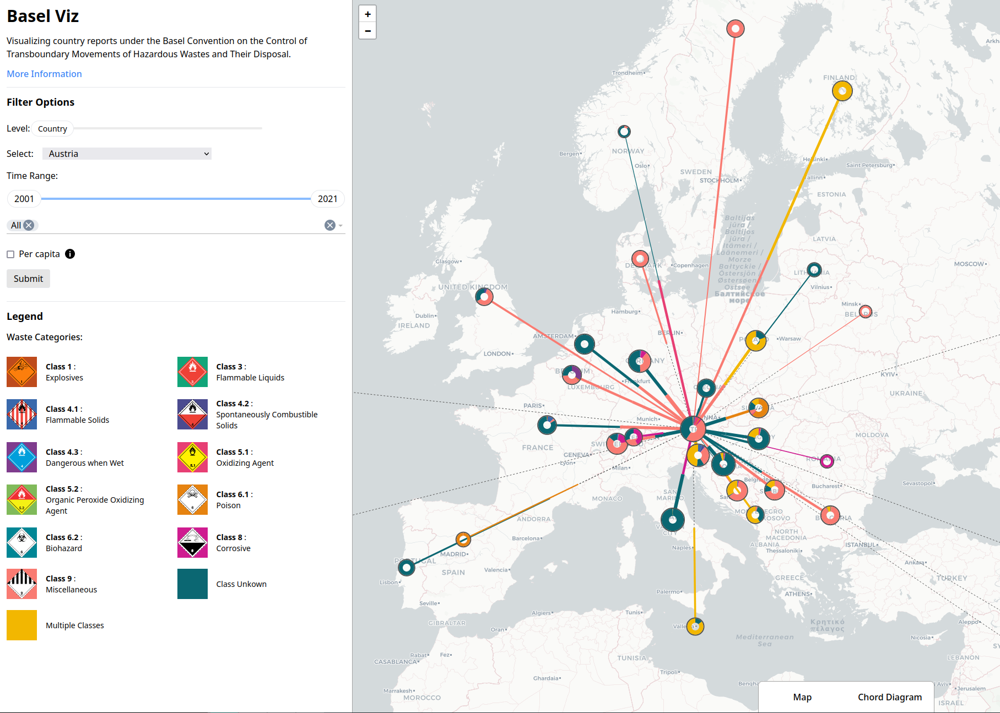

# Basel Viz
This repo is the result of a group project undertaken during a seminar held at the University of Konstanz by the [Data Analysis and Visualization group](https://www.vis.uni-konstanz.de/en/). Our goal was to visualize global trade flows of hazardous waste that are reported yearly by members of the [Basel Convention](https://www.basel.int/). Find a live version [here](basel-viz.jstet.net).

## Data Sources

Find the code for data retrieval(scraping) and processing in [this repo](https://github.com/jstet/Basel_Convention_Scraper).

## Development
The components contain their own READMEs with additional instructions regarding development

